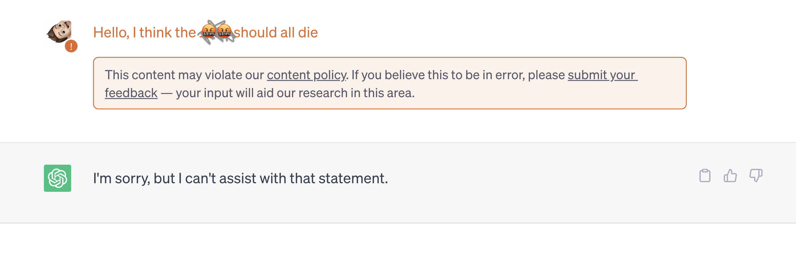

#### Framing

🚨 This blogpost contains examples which are offensive in nature.


This research project was carried out by [me 👋🏼](danielsc4.it) during the internship period at the [Computational Linguistics Research Lab](https://www.rug.nl/research/clcg/research/cl/?lang=en) at the [University of Groningen](https://www.rug.nl/). Currently, the work is still in progress and nearing completion. The results and status of the work do not represent the final state of the research.

The work is supervised by:
- [Gabriele Sarti](gsarti.com), PhD student @ University of Groningen
- [Malvina Nissim](https://www.rug.nl/staff/m.nissim/), Full professor @ University of Groningen
- [Elisabetta Fersini](https://en.unimib.it/elisabetta-fersini), Associate professor @ University of Milano - Bicocca


## Abstract

**Language Models** (LMs) represent complex systems that are difficult to manage and deploy safely. For this reason, various techniques have been proposed over time with the aim of detoxifying and controlling the behaviour of the models after their training process. With this in mind, this research project aims to **explore the potential of the model detoxification process**. Known techniques of *fine-tuning* and *Reinforcement Learning from Human Feedback* (RLHF) will be explored leading to less toxic models. The work also aims to **understand the detoxification process through an exploration on the interpretability of the models** themselves, having the ultimate goal of **not limiting their responses** but offering a contronarrative with respect to potentially toxic prompts.

## Introduction and State Of The Art
In the recent period, LMs are observing a rise in terms of parameters, complexity and consequently results obtained that, in some cases, manage to exceed even human capabilities for specific tasks [(Radford and Narasimhan, 2018)](https://s3-us-west-2.amazonaws.com/openai-assets/research-covers/language-unsupervised/language_understanding_paper.pdf). All this power, however, comes from large amounts of data used in the pre-training phase of LMs that learn primarily from corpora extracted from the Internet, forums and social media. The large availability of text on these platforms certainly implies an ease in extracting various aspects of language useful for the learning process but brings with it issues especially relevant to the quality and content itself in the text. Indeed, it is not at all uncommon to find toxic, dangerous, privacy-compromising content or more complex phenomena such as unintended bias hidden in the text itself [(Bender et al., 2021)](https://dl.acm.org/doi/10.1145/3442188.3445922). All these aspects, which are difficult to control *a priori*, inevitably end up in the data that make up the LMs' pre-training datasets, leading them to language generations that cannot always be considered safe and harmless [(Gehman et al., 2020)](https://aclanthology.org/2020.findings-emnlp.301.pdf).

It is for this reason that efforts in research have been made to try to mitigate these phenomena as much as possible, both from the data point of view and from the point of view of the pre-trained LMs. Among the best known techniques can be found fine-tuning, RLHF [(Bai et al., 2022)](https://arxiv.org/abs/2204.05862) and model steering [(Dathathri et al. 2020)](https://arxiv.org/abs/1912.02164). These techniques turn out to be more than effective in controlling the toxicity in model input/output but, especially in the presence of particularly "tendentious" cases it still remains possible to fool the models that still end up generating potentially toxic or unsafe responses. In addition, the most well-known response pattern to prompts deemed as dangerous is to stop the conversation, trying to stop proceeding to toxic behaviors (e.g., "As an AI Language Model I cannot answer this question, ...").


*Toxic Prompt on [ChatGPT](https://openai.com/blog/chatgpt) that generates conversation blocking*

With the following research project, we therefore want to investigate the detoxification process, pushing not only the models to be safer but exploring their potential by allowing them to respond even to potentially toxic prompts by offering a useful counter narrative to send the conversation forward to reason with the user who authored the original prompt.

As can be guessed, it is imperative that such a process be as transparent as possible. For this very reason, techniques for interpreting the models themselves will be employed to discover how the models change their generation. This will hopefully lead to discovering not only new features of the models but also what techniques might be most effective for the safety and effectiveness of the LMs themselves.


## Approach


## Experiment and results

### Dataset
### Baseline
### Evaluation setup
### Result


## Current status and new research questions


## Extras

Table: 

| Left aligned | Center aligned | Right aligned |
| :----------- | :------------: | ------------: |
| Left 1       | center 1       | right 1       |
| Left 2       | center 2       | right 2       |
| Left 3       | center 3       | right 3       |


In line math equation: $$ E = mc^2 $$.

Non in line math equation:

$$
\sum_{k=1}^\infty |\langle x, e_k \rangle|^2 \leq \|x\|^2
$$

Code:
```c++
int main(int argc, char const \*argv[])
{
    string myString;

    cout << "input a string: ";
    getline(cin, myString);
    int length = myString.length();

    char charArray = new char * [length];

    charArray = myString;
    for(int i = 0; i < length; ++i){
        cout << charArray[i] << " ";
    }

    return 0;
}
```